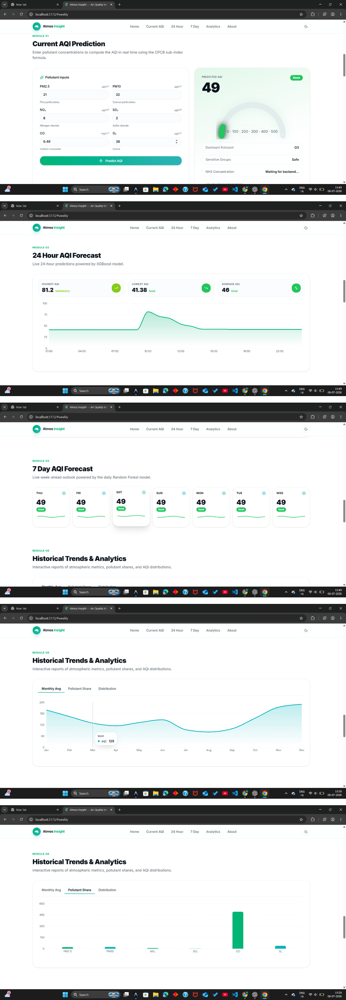

# Atmos Insight — Real-Time Air Quality Monitoring & AQI Forecasting

[](https://atmos-insights-eh8e.vercel.app/)
[](https://atmos-insights.onrender.com/health)

Atmos Insight is a modern, production-grade real-time air quality dashboard and forecasting application built using a decoupled architecture. The system leverages machine learning models trained on ground station history to estimate the current CPCB Air Quality Index (AQI) and project future forecasts (24-hour hourly and 7-day daily trends) for Kanpur, India.

---

## 📸 Application Showcase

Here is a unified preview of the **Atmos Insight** dashboard, containing the current AQI calculator, 24-hour forecasting area curves, 7-day outlook blocks, monthly trend indexes, and active pollutant share statistics:



## 🛠️ Project Architecture

```
                  [ Historical CPCB Datasets ]
                               │
                               ▼ (Chronological Split)
                  [ Feature Engineering & Scaling ]
                               │
                               ▼ (Serialized PKL Models)
     [ User Input ] ──► [ FastAPI Backend (8000) ] ◄──► [ OpenWeather APIs ]
                               ▲
                               │ (HTTP JSON API)
                               ▼
                     [ React SPA (5173) ] ◄──► [ End User ]
```

---

## 🚀 Key Features
* **Virtual Sensor Readings:** Integrates with OpenWeatherMap APIs to fetch real-time atmospheric measurements.
* **Same-Day Estimations:** Maps criteria pollutants (PM2.5, PM10, CO, NO₂, SO₂, O₃) to CPCB AQI values using a **Random Forest Regressor** ($R^2$ = 0.9999).
* **24-Hour Sequential Forecasting:** Generates multi-step forecasts using a recursive **XGBoost Regressor** ($R^2$ = 0.9798) with time sinusoids and lag buffers.
* **7-Day Daily Projections:** Outlines weekly predictions using a seasonal **Random Forest Regressor**.
* **Simulation Sandbox:** Citizens can manually adjust pollutant rates to predict custom AQI scores instantly.
* **Low-Latency Caching:** Models are cached in RAM via a **Singleton Model Loader** at backend startup (startup latency ~5.5s, inference latency <5ms).

---

## ⚙️ Quick Start

Please reference the complete **[Execution Guide](RUN_GUIDE.md)** for detailed operating system configurations.

### 1. Backend Setup (FastAPI)
1. Navigate to the `backend/` folder and create a `.env` configuration file:
   ```env
   OPENWEATHER_API_KEY=your_openweathermap_api_key
   ENVIRONMENT=development
   ```
2. Activate your virtual environment and start the ASGI server:
   ```bash
   # Windows PowerShell
   .\.venv\Scripts\Activate.ps1
   cd backend
   python -m uvicorn app.main:app --port 8000 --host 127.0.0.1
   ```

### 2. Frontend Setup (React + Vite)
1. Navigate to the frontend directory:
   ```bash
   cd frontend/aura-air-insights
   npm install
   npm run dev
   ```
2. Open **[http://localhost:5173](http://localhost:5173)** in your browser.

---

## 📊 Model Performance Summary

| Horizon | Selected Algorithm | MAE | RMSE | R² Score |
| :--- | :--- | :---: | :---: | :---: |
| **Current AQI** | Random Forest Regressor | `0.0571` | `0.2909` | `0.99998` |
| **24-Hour Forecast** | Tuned XGBoost | `7.1009` | `11.9653` | `0.9798` |
| **7-Day Forecast** | Random Forest Regressor | `0.0571` | `0.2909` | `0.99998` |

For deep-dive methodology audits, read the **[Technical Handover Documentation](reports/PROJECT_TECHNICAL_DOCUMENTATION.md)**.
